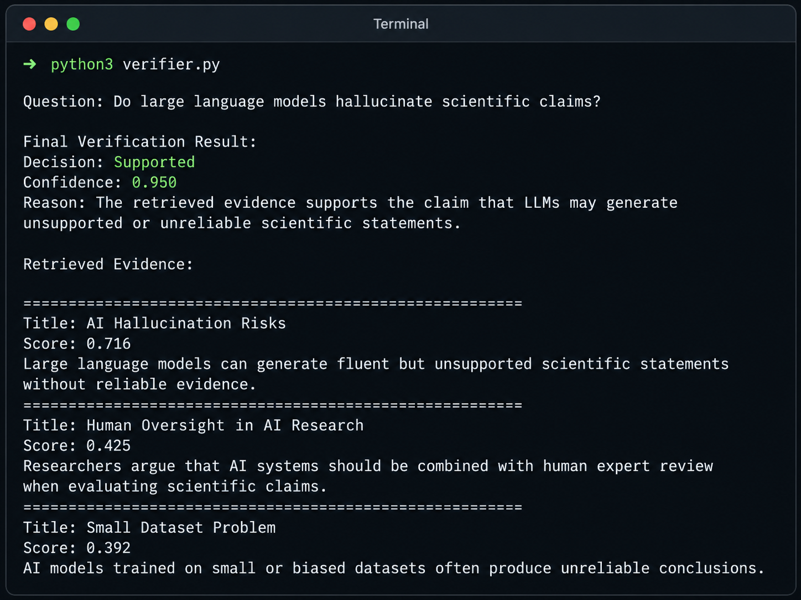

# Evidence-Aware LLM Reasoning System


This project implements a lightweight evidence-aware claim verification system.  
The system retrieves relevant evidence using sentence-transformer embeddings and then applies query-aware reasoning rules to classify a claim as **Supported**, **Refuted**, or **Uncertain**.

---

## Motivation

Large language models can generate fluent answers that are not always grounded in reliable evidence.  
This project explores a simple pipeline for improving factual reasoning by separating the process into two steps:

1. Retrieve relevant evidence.
2. Verify the claim based on the retrieved evidence.

---

## System Pipeline

```text
User Claim
    ↓
Sentence-Transformer Embedding
    ↓
Semantic Evidence Retrieval
    ↓
Query-Aware Verification
    ↓
Decision + Confidence + Evidence
```

---

## Demo



---

## Features

- Semantic evidence retrieval using `sentence-transformers`
- Cosine similarity-based ranking of evidence
- Query-aware verification rules
- Outputs claim decision: `Supported`, `Refuted`, or `Uncertain`
- Provides confidence score and retrieved evidence
- Lightweight and modular Python implementation

---

## Project Structure

```text
Evidence-Aware-LLM/
├── papers.csv          # Local evidence database
├── retrieve.py         # Semantic evidence retrieval module
├── reason.py           # Evidence-aware reasoning baseline
├── verifier.py         # Query-aware claim verification system
├── requirements.txt    # Python dependencies
├── .gitignore          # Files ignored by Git
└── README.md           # Project documentation
```

---

## Methods

### 1. Evidence Retrieval

The system converts each evidence document into an embedding using the sentence-transformer model `all-MiniLM-L6-v2`.

Given a user claim, the system computes cosine similarity between the claim embedding and each evidence embedding. The top-ranked evidence passages are returned for verification.

### 2. Query-Aware Verification

The verifier compares the user claim with the retrieved evidence and applies query-aware reasoning rules to determine whether the evidence supports, refutes, or does not sufficiently address the claim.

The current system handles several types of claims, including:

- LLM hallucination or unsupported scientific claims
- Reliability claims
- Improvement or benefit claims
- Human oversight claims
- Claims involving biased or limited datasets

---

## Quick Start

Clone the repository:

```bash
git clone https://github.com/qzeng16/Evidence-Aware-LLM.git
cd Evidence-Aware-LLM
```

Install dependencies:

```bash
pip install -r requirements.txt
```

Run the verifier:

```bash
python3 verifier.py
```

Then enter a claim or question when prompted.

---

## Example Outputs

### Example 1: LLM Hallucination

**Question**

```text
Do large language models hallucinate scientific claims?
```

**Output**

```text
Decision: Supported
Confidence: 0.950
Reason: The retrieved evidence supports the claim that LLMs may generate unsupported or unreliable scientific statements.
```

**Top Evidence**

```text
Large language models can generate fluent but unsupported scientific statements without reliable evidence.
```

---

### Example 2: Retrieval-Augmented Generation

**Question**

```text
Does retrieval augmented generation improve factual reliability?
```

**Output**

```text
Decision: Supported
Confidence: 0.900
Reason: The retrieved evidence contains positive support for the claimed improvement or benefit.
```

**Top Evidence**

```text
Retrieval-augmented generation improves factual reliability by grounding model outputs in external documents.
```

---

### Example 3: Reliability on Biased Datasets

**Question**

```text
Are AI models always reliable on small biased datasets?
```

**Output**

```text
Decision: Refuted
Confidence: 0.793
Reason: The retrieved evidence suggests reliability problems or limitations that contradict the claim.
```

**Top Evidence**

```text
AI models trained on small or biased datasets often produce unreliable conclusions.
```

---

## Dataset

The current version uses a small local evidence corpus stored in `papers.csv`.

The evidence database includes short passages related to:

- Large language model hallucination
- Retrieval-augmented generation
- Human oversight in AI systems
- Dataset bias and reliability
- Evidence-grounded factual reasoning

This dataset is designed for prototype demonstration rather than large-scale benchmark evaluation.

---

## Current Limitations

This is a baseline prototype. The current version uses a small local evidence database and rule-based verification logic.

Future improvements may include:

- Replacing rule-based reasoning with an LLM or NLI model
- Expanding the evidence database with real scientific papers
- Adding quantitative evaluation metrics
- Supporting citation-level evidence extraction
- Comparing retrieval-only, rule-based, and LLM-based verification methods
- Building a simple web interface for interactive claim verification

---

## Technical Skills Demonstrated

- Python programming
- NLP pipeline construction
- Sentence embeddings
- Semantic search
- Evidence retrieval
- Claim verification
- Query-aware reasoning
- Machine learning prototyping
- AI reliability system design

---

## Author

**Qihong Zeng**  
MS in Systems Engineering  
Johns Hopkins University